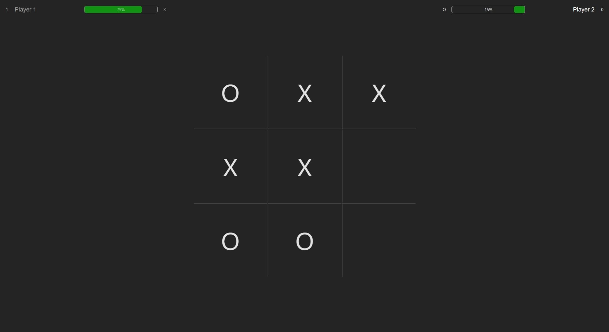

# RNG Tic-Tac-Toe
A unique 1v1 Tic-Tac-Toe game with health bars! Each win deals random damage to your opponent, and the battle continues until one player reaches 0% health.

## Website 
You can visit the website where this project is hosted at:  
https://www.l145.be/rng-tic-tac-toe/

## Features

- **1v1 Tic-Tac-Toe Battles** – Classic Tic-Tac-Toe with a competitive twist.  
- **Health Bar System** – Players start with a health bar; losing rounds drains health.  
- **Luck-Based Draw Penalty** – On a draw, both players lose a random amount of health.  
- **Scoring System** – Score a point each time you drop your opponent’s health to 0%.
- **Editable Player Names** – Customize player names to easily identify who’s playing.
- **Modern & Responsive UI** – Sleek, intuitive design optimized for all devices.  
- **Fast & Optimized** – Built for smooth performance with minimal load times.  

## Technologies Used

- React
- TypeScript
- Vite
- HTML & CSS

## Contact
If you have any questions or suggestions, feel free to reach out:

- Email: business@l145.be
- LinkedIn: https://www.linkedin.com/in/aryan-shah-l145
- GitHub: legelff